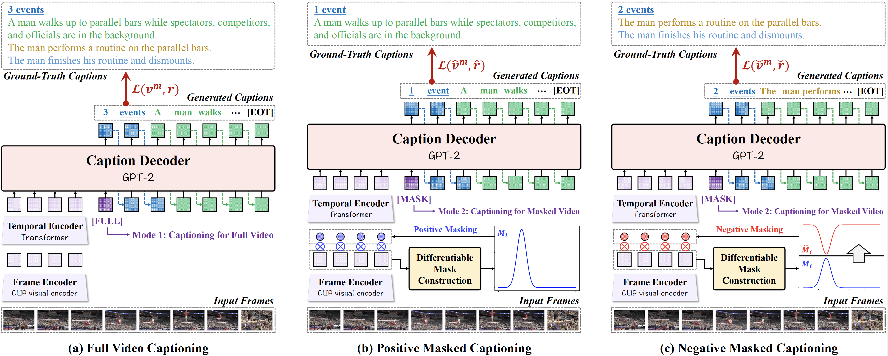

**Repository for our AAAI'25 paper titled "Implicit Location-Caption Alignment via Complementary Masking for Weakly-Supervised Dense Video Captioning".**

## About

Weakly-Supervised Dense Video Captioning (WSDVC) aims to localize and describe all events of interest in a video without requiring annotations of event boundaries. This setting poses a great challenge in accurately locating the temporal location of event, as the relevant supervision is unavailable. Existing methods rely on explicit alignment constraints between event locations and captions, which involve complex event proposal procedures during both training and inference. To tackle this problem, we propose a novel implicit location-caption alignment paradigm by complementary masking, which simplifies the complex event proposal and localization process while maintaining effectiveness. Specifically, our model comprises two components: a dual-mode video captioning module and a mask generation module. The dual-mode video captioning module captures global event information and generates descriptive captions, while the mask generation module generates differentiable positive and negative masks for localizing the events. These masks enable the implicit alignment of event locations and captions by ensuring that captions generated from positively and negatively masked videos are complementary, thereby forming a complete video description. In this way, even under weak supervision, the event location and event caption can be aligned implicitly. Extensive experiments on the public datasets demonstrate that our method outperforms existing weakly-supervised methods and achieves competitive results compared to fully-supervised methods.

<div align="center">
    
</div>

## Preparation
1. Download the dataset and the base model.
2. Install the requirements.

## Training & Inference
```bash
cd src
accelerate launch --config_file accelerate.yaml main_accelerate.py --cap-epochs 10 --total-epochs 20 --lr 1e-4
```

## Citation
If you find our paper and code useful in your research, please consider giving a star ⭐ and citation 📝 :)

```
@misc{ge2024implicitlocationcaptionalignmentcomplementary,
      title={Implicit Location-Caption Alignment via Complementary Masking for Weakly-Supervised Dense Video Captioning}, 
      author={Shiping Ge and Qiang Chen and Zhiwei Jiang and Yafeng Yin and Liu Qin and Ziyao Chen and Qing Gu},
      year={2024},
      eprint={2412.12791},
      archivePrefix={arXiv},
      primaryClass={cs.CV},
      url={https://arxiv.org/abs/2412.12791}, 
}
```


